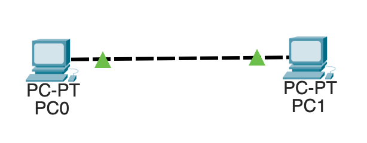

# Project: Packet Tracer: Connect Two Computers

In this project, we're going to build a simple network between two
computers using Cisco's [fl[Packet
Tracer|https://www.netacad.com/courses/packet-tracer]] tool. It's free!

If you don't have it installed, check out [Appendix: Packet
Tracer](#appendix-packettracer) for installation information.

If at any time you make a mistake that you need to delete, choose the
"Delete" tool from the second icon row down.

## Adding Computers to the LAN

Select "End Devices" lower left.


Then drag two "PC"s out onto the work area from the panel in the lower
middle.


## Wiring PCs Directly Together

Now that you have two PCs in the workspace, let's wire them together.

Click on the "Connections" icon in the lower left.


Click on the "Copper Cross-Over" icon in the lower middle. (The icon
will change to an "anti" symbol.)


Click on one of the PCs. Select "FastEthernet0".

Click on the other PC. Select "FastEthernet0".

You should now see something like this:



## Setting Up the IP Network

Neither of these computers have IP addresses yet. We'll set them up with
static IPs of our choosing.

1. Click on PC0.

2. Click the "Config" tab.

3. Click "FastEthernet0" in the sidebar.

4. For "IPv4 Address", enter `192.168.0.2`.

5. For "Subnet Mask", enter `255.255.255.0`.

Close the configuration window.

Click on PC1 and do the same steps, except enter `192.168.0.3` for the
IP address. Close the configuration window when you're done.

## Pinging Across the Network

Let's ping from PC0 to PC1 to make sure the network is connected.

1. Click on PC0. Select the "Desktop" tab.

2. Click on "Command Prompt".

3. In the command prompt, type `ping 192.168.0.3`.

> When you ping, the first ping might timeout because ARP needs to do
> its work first. In more complex networks, multiple pings might timeout
> before getting through.

You should see successful ping output:

``` {.sh}
C:\>ping 192.168.0.3

Pinging 192.168.0.3 with 32 bytes of data:

Reply from 192.168.0.3: bytes=32 time<1ms TTL=128
Reply from 192.168.0.3: bytes=32 time<1ms TTL=128
Reply from 192.168.0.3: bytes=32 time<1ms TTL=128
Reply from 192.168.0.3: bytes=32 time<1ms TTL=128

Ping statistics for 192.168.0.3:
    Packets: Sent = 4, Received = 4, Lost = 0 (0% loss),
Approximate round trip times in milli-seconds:
    Minimum = 0ms, Maximum = 0ms, Average = 0ms
```

If you see `Request timed out.` more than twice, something is
misconfigured.

## Saving the Project

Be sure to save the project. This will save a file with `.pkt`
extension.

<!-- Rubric

5
Crossover cable used

5
Two PCs used

5
PCs set up with correct IP addresses.

5
PCs can ping one another.

-->
