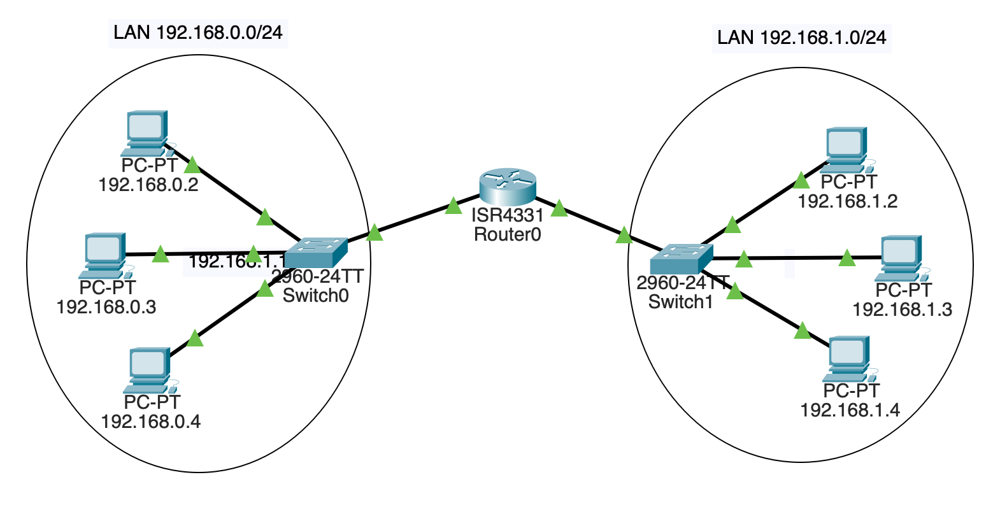

# Project: Packet Tracer: Using a Router

We're going to add a router between two independent networks in Packet
Tracer.

The goal will be something that looks like this:

## Build the LANs

First of all, build two separate LANs. Each will have three PCs and a
2960 switch like before.

The left subnet will be `192.168.0.0/24`. The right subnet will be
`192.168.1.0/24`.

Assign the left PCs the IP addresses on their `FastEthernet0`
interfaces:

* `192.168.0.2`
* `192.168.0.3`
* `192.168.0.4`

Assign the right PCs the IP addresses on their `FastEthernet0`
interfaces:

* `192.168.1.2`
* `192.168.1.3`
* `192.168.1.4`

All of them have subnet mask `255.255.255.0`.

Connect the left PCs to one switch on any unused `FastEthernet` ports.
Connect the right PCs to the other switch in the same way.

At this point, you should have two separate LANs.

Hit the fast-forward button if all the links aren't green yet. If they
stay red, something is wrong--double-check your settings.

For sanity, make sure `192.168.0.2` can ping the other two machines on
its LAN. And make sure `192.168.1.3` can ping the other two machines on
its LAN.

## Adding a Router

The router is going to route traffic between these two networks.

Click the "Network Devices" icon in the lower left. Then click "Routers"
in the bottom left. Then drag a `4331` router in between the two.

This router is going to be connected to both switches. Each "side" of
the router will have a different IP address.

We're going to connect some wires here, but _the link won't come up
yet_. We'll deal with that in a minute.

On the switch on LAN `192.168.0.0/24`, use a Copper Straight-Through
connecter to connect the switch's `GigabitEthernet0/1` port to the
router's `GigabitEthernet0/0/0` port.

On the switch on LAN `192.168.1.0/24`, use the same type of connector to
connect the switch's `GigabitEthernet0/1` port to the router's
`GigabitEthernet0/0/1` port.

Note this is a different port on the router than the other switch is
connected to! Both switches are plugged into different ports on the
router.

We have the hardware in place now, but we don't yet have any IP
addresses assigned on the router. So let's do that.

In the "Config" for the router, choose the `GigabitEthernet0/0/0`
interface and give it the IP address `192.168.0.1`--it's now part of the
`192.168.0.0/24` subnet. While you're here, click the "On" checkbox to
power the port. This should bring up the connection and get you the
green arrows.

Then go to the `GigabitEthernet0/0/1` interface and give it the IP
address `192.168.1.1`--it's now part of the `192.168.1.0/24` subnet.
While you're here, click the "On" checkbox to power the port.

Let's try pinging the router. Go to any PC on the `192.168.0.0/24` LAN
and trying pinging `192.168.0.1` (the router). It should reply.

Then go to any PC on the `192.168.1.0/24` subnet and try pinging
`192.168.1.1`. It should reply.

Now the ultimate test: get a console on PC `192.168.0.2` and try to ping
`192.168.1.2` on the other subnet!

It... doesn't work!

Why?

## Adding a Default Route

All the computers need to know two things:

* What the LAN's subnet number is so it knows to route local traffic on
  the LAN.
* A _default gateway_, the computer on the LAN that should get traffic
  for destinations outside the LAN.

We've put the subnet in, but not the default gateway.

For all the PCs on the `192.168.0.0/24` subnet, go into the "Config",
then choose the "Global" sidebar item. Enter `192.168.0.1` (the router!)
in the "Default Gateway" field.

Do the same for all the PCs on the other subnet, except enter
`192.168.1.1` as the default gateway.

## Try It Out!

Now you should be able to ping any PC from any other PC!

If you can't, try pinging just on one LAN to make sure it works. And
ping the router on that LAN to make sure that works.

<!-- Rubric

5
Three PCs used in two subnets

5
All PCs on the same subnet can ping one another

5
Two switches used in two subnets

10
Router configured on both subnets in different ports

10
Each subnet can ping its own router.

5 
Any computer can ping any other computer on either subnet

-->

